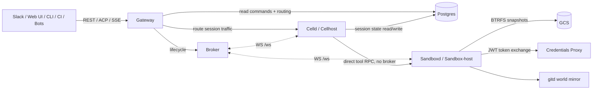

# OpenRiver

OpenRiver is a public implementation scaffold for a Postgres-centric, session-based agent workload platform. It is based on the Aquifer system build plan: a four-tier architecture where Postgres is the durable source of truth for all session state.

> Status: planning/scaffold repository. This repo currently contains architecture docs, API/schema starting points, component boundaries, and the phased build roadmap.

## System summary

OpenRiver replaces an in-memory/container-pool style session runtime with a four-tier platform for cloud VM fleets:

- **Gateway** (`gateway/`): stateless public edge for auth, REST, ACP edge, and SSE.
- **Broker** (`broker/`): control-plane registry and placement service; never in the session or tool-call data path.
- **Celld** (`celld/`): cell lifecycle and DB plane on session hosts; manages session cells as systemd transient units.
- **Sandboxd** (`sandboxd/`): isolated tool execution host using nspawn + BTRFS snapshots.
- **Postgres**: sole source of truth for sessions, events, command inbox, leases, and cell host records.

## Architecture



## Key invariants

- Postgres is the thing that survives.
- Gateway is stateless and holds no per-session state.
- Broker is placement/control-plane only and is not in any data path.
- Session cells hold no Postgres credentials, model API keys, or upstream secrets.
- Sandbox hosts run tool code only; no agent code and no real tokens inside sandboxes.
- Cell state is reconstructable from the Postgres event log.

## Repository layout

```text
OpenRiver/
├── proto/                  # gRPC / API definitions
├── gateway/                # Tier 1 — stateless edge
├── broker/                 # Tier 2 — control plane
├── celld/                  # Tier 3 — session cell host daemon
│   ├── runtime/            # Go Runtime
│   └── agent/              # Pi Harness
├── sandboxd/               # Tier 4 — isolated tool execution daemon
│   ├── credentials-proxy/
│   └── gitd/
├── migrations/             # Postgres schema migrations
├── infra/                  # IaC placeholders
├── docs/                   # Architecture, roadmap, original plan
└── scripts/                # Developer/operator scripts
```

## Build phases

- **Phase 0:** Postgres schema, IaC, CI/CD, JWT infra, observability.
- **Phase 1:** Stateless gateway routing and SSE.
- **Phase 2:** Broker registries, placement, and lifecycle API.
- **Phase 3:** Celld, systemd session cells, Go Runtime, and Pi Harness.
- **Phase 4:** Sandboxd, nspawn/BTRFS sandboxes, credentials proxy, and gitd.
- **Phase 5:** End-to-end validation, River migration, and operational readiness.

See [docs/ROADMAP.md](docs/ROADMAP.md) and [docs/BUILD_PLAN.md](docs/BUILD_PLAN.md) for the full plan.

## Local development

This scaffold does not yet ship runnable services. The first implementation milestone is the Postgres schema and local all-in-one integration harness.

Suggested next steps:

1. Choose implementation languages/frameworks per component.
2. Finalize protobuf/API contracts in `proto/`.
3. Apply `migrations/0001_initial_schema.sql` to a local Postgres instance.
4. Add the single-node integration harness under `scripts/` or `infra/local/`.

## License

License is currently TBD. Add a `LICENSE` file before accepting external contributions.
