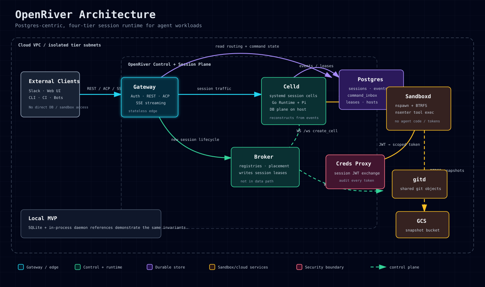
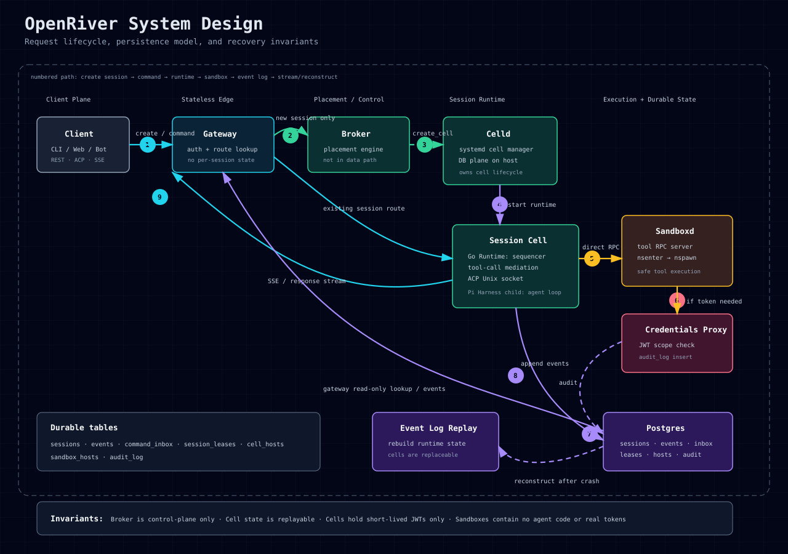
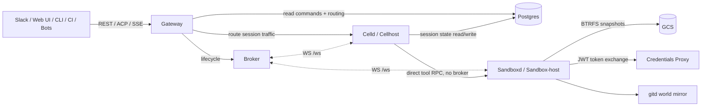

# OpenRiver

OpenRiver is a runnable local MVP for a Postgres-centric, session-based agent workload platform. It is based on the Aquifer system build plan: a four-tier architecture where Postgres is the durable source of truth for all session state.

> Status: local MVP plus planning docs. The repo now includes a runnable, self-contained Python stdlib implementation that demonstrates the Aquifer four-tier architecture on SQLite for local development.

## System summary

OpenRiver replaces an in-memory/container-pool style session runtime with a four-tier platform for cloud VM fleets:

- **Gateway** (`gateway/`): stateless public edge for auth, REST, ACP edge, and SSE.
- **Broker** (`broker/`): control-plane registry and placement service; never in the session or tool-call data path.
- **Celld** (`celld/`): cell lifecycle and DB plane on session hosts; manages session cells as systemd transient units.
- **Sandboxd** (`sandboxd/`): isolated tool execution host using nspawn + BTRFS snapshots.
- **Postgres**: sole source of truth for sessions, events, command inbox, leases, and cell host records.

## Architecture

### Four-tier architecture diagram



### System design / request lifecycle diagram



The diagrams above are checked into `docs/assets/` as SVG files so they render directly in GitHub and remain editable as code.



## Key invariants

- Postgres is the thing that survives.
- Gateway is stateless and holds no per-session state.
- Broker is placement/control-plane only and is not in any data path.
- Session cells hold no Postgres credentials, model API keys, or upstream secrets.
- Sandbox hosts run tool code only; no agent code and no real tokens inside sandboxes.
- Cell state is reconstructable from the Postgres event log.

## Repository layout

```text
OpenRiver/
├── proto/                  # gRPC / API definitions
├── gateway/                # Tier 1 — stateless edge
├── broker/                 # Tier 2 — control plane
├── celld/                  # Tier 3 — session cell host daemon
│   ├── runtime/            # Go Runtime
│   └── agent/              # Pi Harness
├── sandboxd/               # Tier 4 — isolated tool execution daemon
│   ├── credentials-proxy/
│   └── gitd/
├── migrations/             # Postgres schema migrations
├── openriver/              # Runnable local MVP implementation
├── tests/                  # unittest coverage for lifecycle/security invariants
├── infra/                  # IaC placeholders
├── docs/                   # Architecture, roadmap, original plan
└── scripts/                # Developer/operator scripts
```

## Build phases

- **Phase 0:** Postgres schema, IaC, CI/CD, JWT infra, observability.
- **Phase 1:** Stateless gateway routing and SSE.
- **Phase 2:** Broker registries, placement, and lifecycle API.
- **Phase 3:** Celld, systemd session cells, Go Runtime, and Pi Harness.
- **Phase 4:** Sandboxd, nspawn/BTRFS sandboxes, credentials proxy, and gitd.
- **Phase 5:** End-to-end validation, River migration, and operational readiness.

See [docs/ROADMAP.md](docs/ROADMAP.md) and [docs/BUILD_PLAN.md](docs/BUILD_PLAN.md) for the full plan.

## Local development

The local MVP uses only the Python standard library. It runs Gateway, Broker, Celld, Sandboxd, a deterministic runtime, HMAC session JWTs, and SQLite persistence in one process while preserving the Aquifer/Postgres concepts (`sessions`, `events`, `command_inbox`, `cell_hosts`, `session_leases`, `sandbox_hosts`, `audit_log`).

### Quickstart

Run the end-to-end demo:

```bash
cd /home/ec2-user/OpenRiver
python -m openriver.cli demo --db /tmp/openriver.db
```

Run the HTTP API:

```bash
python -m openriver.cli serve --db /tmp/openriver.db --host 127.0.0.1 --port 8080
```

Example API calls:

```bash
curl http://127.0.0.1:8080/healthz
curl -X POST http://127.0.0.1:8080/sessions -d '{"tenant_id":"demo"}'
curl -X POST http://127.0.0.1:8080/sessions/$SESSION_ID/commands \
  -d '{"type":"tool","payload":{"name":"uppercase","args":{"text":"openriver"}}}'
curl http://127.0.0.1:8080/sessions/$SESSION_ID/events
```

Run tests:

```bash
python -m unittest discover -s tests
```

Run the acceptance/property/Gherkin coverage gate:

```bash
python scripts/coverage_check.py --min 75
```

Run targeted mutation testing for core invariants:

```bash
python scripts/mutation_test.py
```

Run DRY analysis for duplicate code blocks, repeated literals, and repeated function shapes:

```bash
python scripts/dry_analysis.py --format markdown --max-blocks 2 > docs/DRY_ANALYSIS.md
```

Test suite layers:

- Unit and integration tests: `tests/test_mvp.py`
- Property-style randomized tests: `tests/test_properties.py`
- HTTP acceptance tests: `tests/test_acceptance_http.py`
- Gherkin acceptance criteria: `features/openriver_acceptance.feature` executed by `tests/test_gherkin_acceptance.py`
- Mutation gate: `scripts/mutation_test.py`
- DRY analysis: `scripts/dry_analysis.py` with the latest report in `docs/DRY_ANALYSIS.md`

### Local MVP limitations

- SQLite is used for local dev; production remains Postgres-oriented.
- Daemons communicate in-process rather than over gRPC/WebSockets.
- Sandbox tools are safe simulations only: `echo`, `uppercase`, `list_files`, plus a fake credential exchange.
- The runtime/model path is deterministic and does not call external model APIs.
- JWTs are stdlib HMAC tokens intended for local demonstration, not production key management.

See [docs/ROADMAP.md](docs/ROADMAP.md) and [docs/BUILD_PLAN.md](docs/BUILD_PLAN.md) for the full plan.

## License

License is currently TBD. Add a `LICENSE` file before accepting external contributions.
